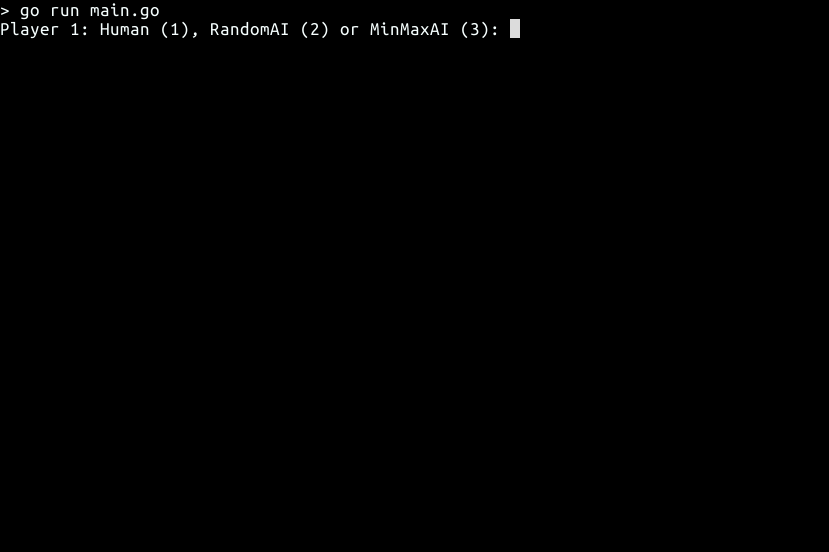

# TicTacToe      <a href='https://github.com/jpoles1/gopherbadger' target='_blank'></a> [](https://godoc.org/github.com/anastalaz/tictactoe)  [](https://goreportcard.com/report/github.com/anastalaz/tictactoe)

 TicTacToe provides various AI agents for the Tic Tac Toe game.

## About

 This package is inspired by a blog post by [Rob Heaton](https://robertheaton.com/2018/10/09/programming-projects-for-advanced-beginners-3-a/). As of now there are two agents implemented:
 1. RandomAI: makes a random legal move.
 2. MinMaxAI: uses the [MinMax](https://en.wikipedia.org/wiki/Minimax) algorithm to find the optimal move.

 There are three game modes to choose from:
 1. Human vs. Human
 2. Human vs. AI
 3. AI vs. AI




## Installation

```console
$ go get github.com/anastalaz/tictactoe
```

## Example

```go
package main

import (
	"fmt"

	ttt "github.com/anastalaz/tictactoe"
)

func main() {
	p1, p2, err := ttt.Config()
	if err != nil {
		fmt.Println(err)
		return
	}

	ttt.Play(p1, p2)
}
```
